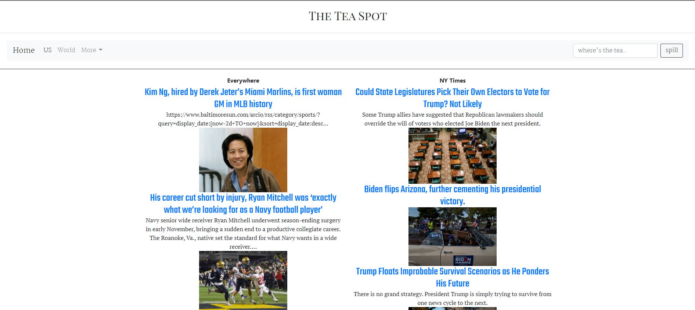
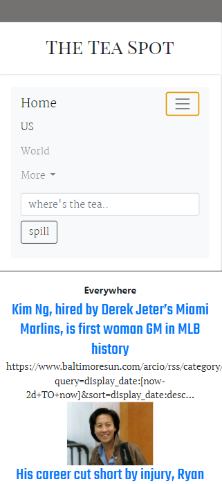
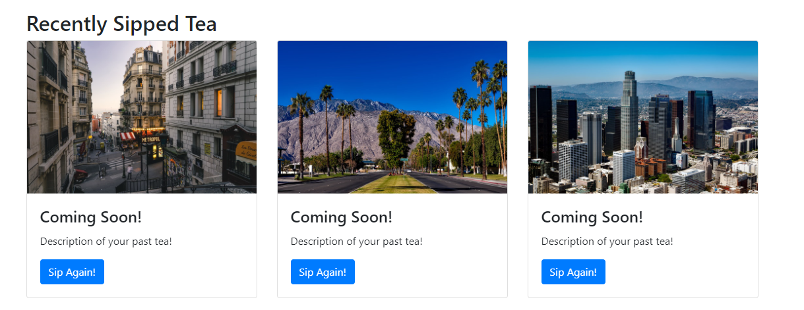

# The Tea Spot

## Description

Do news sources/websites ever bother you with just how much is going on on their web pages that you exit the page as soon as you open it? That these sources are way too overwhelming that you don’t really ever know where to start, but it’s all you’ve got? Or that certain sources really only publish news articles that they approve of or maybe fits their specific values and viewpoints?
Well we introduce to you, THE TEA SPOT, Your number 1 hot spot for trending news. Where news articles are sourced from different credible sources, all in one.

## Apis

NYtimes.api https://developer.nytimes.com/apis
Currents.api https://currentsapi.services/en

## Screenshots

## Links
* Github: https://github.com/ShaniBlack/TheTeaSpot
* Deployed: https://shaniblack.github.io/TheTeaSpot/

## Collaborators

[Ivy Gabrielle Nalo](https://github.com/inalo1)
[Ryan Henson](https://github.com/Ryan-Henson)
[Shani Black](https://github.com/ShaniBlack)
